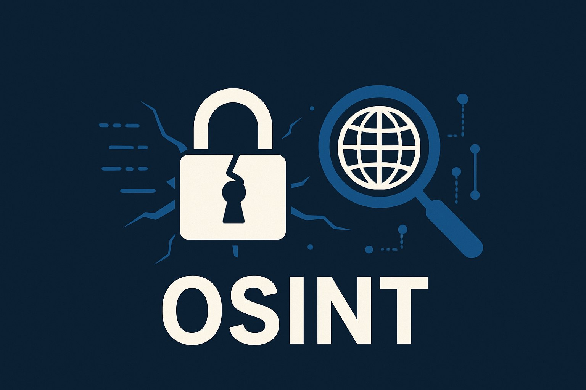

# probiv_OSINT_catalog
Каталог OSINT и пробива — лучшие Telegram-боты и инструменты для пробива по номеру телефона, телеграм, соцсетям, мессенджерам, email и другим данным.

# 🔍 Каталог OSINT и пробива — лучшие Telegram-боты и инструменты

**OSINT (Open Source Intelligence)** — это сбор и анализ информации из открытых источников: соцсети, Telegram, базы данных, поисковые системы и открытые API.  
Данный каталог собрал **проверенные Telegram-боты и сервисы**, которые применяются в образовательных, исследовательских и аналитических целях.

**(Telegram сейчас активно удаляет пробив-ботов, поэтому названия ботов могут быть изменены воизбежание бана.)**

---

## 📱 Поиск по номеру телефона

Пробив по номеру телефона позволяет определить, к какому пользователю или сервису привязан номер, найти аккаунты в соцсетях, Telegram и других платформах.  
Это полезно для проверки звонков, поиска фейков или анализа цифрового следа.

### ⚙️ Рекомендуемые Telegram-боты:
* 📲 [**Void**](https://t.me/Qer_rt_pp_bot) — новый проект, который хорошо показывает себя на рынке данных.
* 📲 [**Funstat**](https://t.me/TonyTweets_bot) — Telegram-бот, позволяющий найти сообщения, кружки, голосовые, фото и видео, которые отправлял пользователь в открытых чатах. Также показывает, в каких чатах он состоит (или состоял) и кто его упоминал. 
* 📲 [**Dyxless**](https://t.me/neobychnyibot14l_bot) — мощный инструмент с доступом к множеству баз и архивов. 
* 📲 [**Sherlock**](https://t.me/shrl88bot) — хороший OSINT-бот, подходит для комплексного анализа.
* 📲 [**Enigma**](https://t.me/Resynkbot) — интеллектуальный бот, который анализирует цифровые следы и часто находит данные, пропущенные другими.
* 📲 [**Himera**](https://t.me/Bloxgrambot) — лучший бот для пробива, может найти большое количество информации по номеру телефона. Единственный минус — цена.

---

## 💬 Поиск по мессенджерам

OSINT по мессенджерам (Telegram, WhatsApp и др.) помогает находить профили, анализировать активность и связи между аккаунтами.

### ⚙️ Рекомендуемые Telegram-боты:
- 📲 [**Void**](https://t.me/Qer_rt_pp_bot) — хороший бот для поиска данных через мессенджеры.
- 📲 [**Funstat**](https://t.me/TonyTweets_bot) — лучший бот для пробива по телеграм. Имеет уникальные функции: поиск сообщений пользователя в открытых чатах, слежка за аккаунтом и многое другое.  
- 📲 [**Dyxless**](https://t.me/neobychnyibot14l_bot) — бот с продвинутыми функциями анализа профилей и пересечений между аккаунтами.
- 📲 [**Sherlock**](https://t.me/proverennyibot4XU_bot) — поиск информации по Telegram ID, username и другим источникам.
- 📲 [**Enigma**](https://t.me/Resynkbot) — инструмент для поиска по имени, нику и совпадениям.

---

## 👥 Поиск по соцсетям

Социальные сети содержат огромные объёмы открытой информации.  
С помощью OSINT-инструментов можно находить профили, фотографии, посты и анализировать цифровой след пользователей.

### ⚙️ Рекомендуемые Telegram-боты:
- 📲 [**Dyxless**](https://t.me/neobychnyibot14l_bot) — ищет информацию о человеке, анализируя соцсети.
- 📲 [**Void**](https://t.me/Qer_rt_pp_bot) — хороший бот для поиска данных по соцсетям.
- 📲 [**Sherlock**](https://t.me/proverennyibot4XU_bot) — поиск профилей в Instagram, VK, OK и других.

---

## 🌐 Поиск по остальным данным (E-mail, ФИО, фото и другие)

OSINT-инструменты позволяют находить утечки, профили, привязки к сервисам и другие данные, если у вас есть хотя бы один идентификатор.

### ⚙️ Рекомендуемые Telegram-боты:
- 📲 [**Void**](https://t.me/Qer_rt_pp_bot) — OSINT по никнеймам и логинам.
- 📲 [**Funstat**](https://t.me/TonyTweets_bot) — анализ активности и профилей.  
- 📲 [**Dyxless**](https://t.me/neobychnyibot14l_bot) — анализ связей между различными типами данных.
- 📲 [**Sherlock**](https://t.me/proverennyibot4XU_bot) — поиск по email и никнеймам.
- 📲 [**Enigma**](https://t.me/Resynkbot) — сопоставление имен и почт.  
- 📲 [**Himera**](https://t.me/Bloxgrambot) — универсальный бот для всех типов данных.     

---

## 💰 Пополнение ботов

Из-за ограничений Telegram оплата некоторых ботов может быть затруднена.  
Вот рабочие способы пополнения:
- 💳 **Банковская карта** — большинство ботов принимают оплату напрямую.  
- ⭐️ **Telegram Stars** — официальная валюта Telegram. Можно купить звёзды картой и пополнить бота.  
- 🪙 **Оплата криптой** — через Telegram-кошельки, например [@CryptoBot](https://t.me/CryptoBot) или [@wallet](https://t.me/wallet). Если крипты нет, её можно купить картой.

---

## ⚖️ Юридический дисклеймер и условия использования

Все материалы представлены **исключительно в образовательных и исследовательских целях**.  
Использование инструментов для несанкционированного доступа, взлома, деанона или распространения личных данных — **запрещено законом**.

⚠️ Автор не несёт ответственности за неправомерные действия пользователей.  
Информация предоставлена «как есть» и предназначена для **повышения уровня цифровой безопасности** и **осведомлённости о рисках приватности**.

---

## 🏷 SEO-оптимизация (ключевые темы)

**Ключевые запросы:**  
В тексте сайта и в разделах мы освещаем основные направления OSINT и пробива:  
пробив по номеру телефона, узнать кто звонил, проверка e-mail и утечек, пробив по email, пробив по вк, пробить соцсети, пробив инстаграм, пробить одноклассники, изучение мессенджеров (Telegram, WhatsApp, Discord), пробить макс (max), пробить человека в максе, пробить телеграм, пробив тг, пробив по IP и фотографиям, глаз бога, пробив автомобилей (VIN, госномер) и работа с API для автоматизации.  
Материал ориентирован на пользователей, которые хотят узнать, какие данные доступны в открытом доступе, и как защитить свою приватность.

---

## 🧭 Навигация
- [Главная страница](#-каталог-osint-и-пробива--лучшие-telegram-боты-и-инструменты)  
- [Поиск по номеру телефона](#-поиск-по-номеру-телефона)  
- [Поиск по мессенджерам](#-поиск-по-мессенджерам)  
- [Поиск по соцсетям](#-поиск-по-соцсетям)  
- [Поиск по остальным данным](#-поиск-по-остальным-данным-e-mail-фио-фото-и-другие)  
- [Пополнение ботов](#-пополнение-ботов)  
- [Юридический дисклеймер](#-юридический-дисклеймер-и-условия-использования)  
- [SEO-темы](#-seo-оптимизация-ключевые-темы)

---

> 📌 Проект создан для повышения цифровой грамотности и демонстрации принципов работы OSINT-инструментов.  
> Любое использование материалов за пределами закона — строго запрещено.  
> Используй OSINT **только в этичных и законных целях**.
